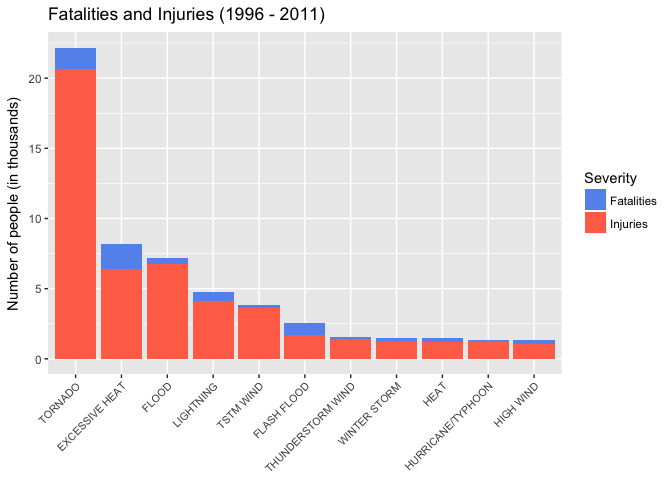

# The effects of severe weather events on population health and economics.
Stijn Servaes  
06 July 2017  


## 1. SYNOPSIS

***

## 2. INTRODUCTION

Storms and other severe weather events can cause both public health and economic problems for communities and municipalities. Many severe events can result in fatalities, injuries, and property damage, and preventing such outcomes to the extent possible is a key concern.

This project involves exploring the U.S. National Oceanic and Atmospheric Administration's (NOAA) storm database. This database tracks characteristics of major storms and weather events in the United States, including when and where they occur, as well as estimates of any fatalities, injuries, and property damage.

***

## 3. DATA

The data for this assignment come in the form of a comma-separated-value file compressed via the bzip2 algorithm to reduce its size. You can download the file from the course web site:

* [Storm Data](https://d396qusza40orc.cloudfront.net/repdata%2Fdata%2FStormData.csv.bz2) [47Mb]

There is also some documentation of the database available. Here you will find how some of the variables are constructed/defined:

* [National Weather Service Storm Data Documentation](https://d396qusza40orc.cloudfront.net/repdata%2Fpeer2_doc%2Fpd01016005curr.pdf)
* [National Climatic Data Center Storm Events FAQ](https://d396qusza40orc.cloudfront.net/repdata%2Fpeer2_doc%2FNCDC%20Storm%20Events-FAQ%20Page.pdf)

The events in the database start in the year 1950 and end in November 2011. In the earlier years of the database there are generally fewer events recorded, most likely due to a lack of good records. More recent years should be considered more complete.

***

## 4. DATA PROCESSING

Download, unzip and load data into a dataframe called `storm`.
As data in the earlier years of the dataset is likely to be skewed due to a lack of good records, a subset of the more recent years was made. This date was arbitrarily set at 1996-01-01.


```r
# Load in the data
setwd("/Users/sservaes/datasciencecoursera/RepData_PeerAssessment2")
if(!file.exists("StormData.csv.bz2")) {
        download.file("https://d396qusza40orc.cloudfront.net/repdata%2Fdata%2FStormData.csv.bz2", "StormData.csv.bz2")
}
storm <- read.csv("StormData.csv.bz2")

# Subset the dataset by removing the data before 1996-01-01
storm$BGN_DATE <- as.Date(storm$BGN_DATE, format = "%m/%d/%Y", "%Y")
storm_select <- storm[which(storm$BGN_DATE >= "1996-01-01"),]
```

In order to identify which severe weather type had the most influence on population health, the data was further processed as follows:

* A new dataframe `EVTYPE_pop` was made to summarise variables according to `EVTYPE`.
* The sum of `FATALITIES` was made according to `EVTYPE` in a variable `fatalities`.
* The sum of `INJURIES` was made according to `EVTYPE` in a variable `injuries`.
* `FATALITIES` and `INJURIES` were summed together according to `EVTYPE` in a variable `affected_population`.
* In order to identify the worst severe weather types in respect to population health, a variable `EVTYPE_pop_worst` was made which grouped all the weather types that affected more than 1000 people (injuries or fatalities).


```r
# Summarise the dataset by fatalities and injuries.
EVTYPE_pop <- ddply(storm_select, ~EVTYPE, summarise, fatalities = sum(FATALITIES), injuries = sum(INJURIES), affected_population = sum(FATALITIES)+sum(INJURIES))
```

In order to identify which severe weather type had the most influence on economics, the data was further processed as follows:

* Total damages were calculated taking the exponential into account.
* 


```r
# Calculated total damage to property.
storm_select$PROPDMGTOT <- storm_select$PROPDMG
storm_select$PROPDMGTOT[which(storm_select$PROPDMGEXP=="K")] <- storm_select$PROPDMG[which(storm_select$PROPDMGEXP=="K")] * 1000
storm_select$PROPDMGTOT[which(storm_select$PROPDMGEXP=="M")] <- storm_select$PROPDMG[which(storm_select$PROPDMGEXP=="M")] * 1000000
storm_select$PROPDMGTOT[which(storm_select$PROPDMGEXP=="B")] <- storm_select$PROPDMG[which(storm_select$PROPDMGEXP=="B")] * 1000000000

# Calculated total damage to crops.
storm_select$CROPDMGTOT <- storm_select$CROPDMG
storm_select$CROPDMGTOT[which(storm_select$CROPDMGEXP=="K")] <- storm_select$CROPDMG[which(storm_select$CROPDMGEXP=="K")] * 1000
storm_select$CROPDMGTOT[which(storm_select$CROPDMGEXP=="M")] <- storm_select$CROPDMG[which(storm_select$CROPDMGEXP=="M")] * 1000000
storm_select$CROPDMGTOT[which(storm_select$CROPDMGEXP=="B")] <- storm_select$CROPDMG[which(storm_select$CROPDMGEXP=="B")] * 1000000000

EVTYPE_eco <- ddply(storm_select, ~EVTYPE, summarise, property_damage = sum(PROPDMGTOT), crop_damage = sum(CROPDMGTOT), total_costs = sum(PROPDMGTOT)+sum(CROPDMGTOT))

# Melt the data according to EVTYPE by property_damage and crop_damage
EVTYPE_eco_melt <- melt(EVTYPE_eco, EVTYPE = c(EVTYPE_eco$property_damage, EVTYPE_eco$crop_damage))
```

```
## Using EVTYPE as id variables
```

***

## 5. RESULTS

### 5.1 Population Health

In order to identify which types of events (as indicated in the 𝙴𝚅𝚃𝚈𝙿𝙴 variable) are most harmful with respect to population health in the United States between 1996 and 2011, the variables `fatalities` and `injuries` were plotted between that time period.


```r
# Determine the worst weather types (those that affect more that 1000 people).
EVTYPE_pop_worst <- EVTYPE_pop[which(EVTYPE_pop$affected_population>1000),]

# Data used for the plot.
print(EVTYPE_pop_worst, row.names = FALSE)
```

```
##             EVTYPE fatalities injuries affected_population
##     EXCESSIVE HEAT       1797     6391                8188
##        FLASH FLOOD        887     1674                2561
##              FLOOD        414     6758                7172
##               HEAT        237     1222                1459
##          HIGH WIND        235     1083                1318
##  HURRICANE/TYPHOON         64     1275                1339
##          LIGHTNING        651     4141                4792
##  THUNDERSTORM WIND        130     1400                1530
##            TORNADO       1511    20667               22178
##          TSTM WIND        241     3629                3870
##       WINTER STORM        191     1292                1483
```

```r
# Generate the fatalities plot.
plot_fatalities <- ggplot(EVTYPE_pop_worst, aes(x = EVTYPE, y = fatalities/1000)) +
        geom_bar(stat = "identity") +
        theme(axis.text.x = element_text(angle = 90), axis.title.x = element_blank(),
              plot.margin = unit(c(1,1,1,1), "cm")) +
        ggtitle("Fatalities (1996 - 2011)") +
        ylab("Fatalities (in thousands)")

# Generate the injuries plot.
plot_injuries <- ggplot(EVTYPE_pop_worst, aes(x = EVTYPE, y = injuries/1000)) + 
        geom_bar(stat = "identity") +
        theme(axis.text.x = element_text(angle = 90), axis.title.x = element_blank(),
              plot.margin = unit(c(1,1,1,1), "cm")) + 
        ggtitle("Injuries (1996 - 2011)") + 
        ylab("Injuries (in thousands)")

# Arrange the two plots together.
grid.arrange(plot_fatalities, plot_injuries, ncol = 2)
```

<!-- -->

From the plots it is clear that in terms of fatalities the following 3 weather types have the highest numbers. 

```r
print(EVTYPE_pop_worst[order(-EVTYPE_pop_worst$fatalities),][1:3,1:2], row.names = FALSE)
```

```
##          EVTYPE fatalities
##  EXCESSIVE HEAT       1797
##         TORNADO       1511
##     FLASH FLOOD        887
```

The highest amount of injuries were seen in the following 3 weather types:


```r
print(EVTYPE_pop_worst[order(-EVTYPE_pop_worst$injuries),][1:3,c(1,3)], row.names = FALSE)
```

```
##          EVTYPE injuries
##         TORNADO    20667
##           FLOOD     6758
##  EXCESSIVE HEAT     6391
```

The highest amount of injuries and fatalities combined were seen in the following 3 weather types:


```r
print(EVTYPE_pop_worst[order(-EVTYPE_pop_worst$injuries),][1:3,c(1,4)], row.names = FALSE)
```

```
##          EVTYPE affected_population
##         TORNADO               22178
##           FLOOD                7172
##  EXCESSIVE HEAT                8188
```

### 5.2 Economic consequences

In order to identify which types of events (as indicated in the 𝙴𝚅𝚃𝚈𝙿𝙴 variable) are most harmful with respect to population health in the United States between 1996 and 2011, the variables `fatalities` and `injuries` were plotted between that time period.


```r
# Determine the worst weather types for economics (those that have a total cost higher than 5 billion USD).
EVTYPE_eco_worst <- EVTYPE_eco[which(EVTYPE_eco$total_costs>5000000000),]

# Data used for the plot.
EVTYPE_eco_worst <- EVTYPE_eco_worst[order(-EVTYPE_eco_worst$total_costs),]
print(EVTYPE_eco_worst, row.names = FALSE)
```

```
##             EVTYPE property_damage crop_damage  total_costs
##              FLOOD    143944833550  4974778400 148919611950
##  HURRICANE/TYPHOON     69305840000  2607872800  71913712800
##        STORM SURGE     43193536000        5000  43193541000
##            TORNADO     24616945710   283425010  24900370720
##               HAIL     14595143420  2476029450  17071172870
##        FLASH FLOOD     15222203910  1334901700  16557105610
##          HURRICANE     11812819010  2741410000  14554229010
##            DROUGHT      1046101000 13367566000  14413667000
##     TROPICAL STORM      7642475550   677711000   8320186550
##          HIGH WIND      5247860360   633561300   5881421660
##           WILDFIRE      4758667000   295472800   5054139800
##          TSTM WIND      4478026440   553915350   5031941790
```

```r
# Melt the data according to EVTYPE by property_damage and crop_damage
EVTYPE_eco_melt <- melt(EVTYPE_eco_worst, id.vars = "EVTYPE", measure.vars =  c("crop_damage", "property_damage"), variable.name="damage_type", value.name="damage_cost")

# Generate the fatalities plot.
plot_eco <- ggplot(EVTYPE_eco_melt, aes(x = reorder(EVTYPE, -damage_cost), y = damage_cost/1000000000)) +
        geom_bar(stat = "identity", aes(fill = damage_type)) +
        theme(axis.text.x = element_text(angle = 90), axis.title.x = element_blank()) + 
        ggtitle("Economic Costs (1996 - 2011)") + 
        ylab("USD (in billions)") +
        scale_fill_manual(values=c("cornflowerblue", "coral1"))
plot_eco
```

<!-- -->
